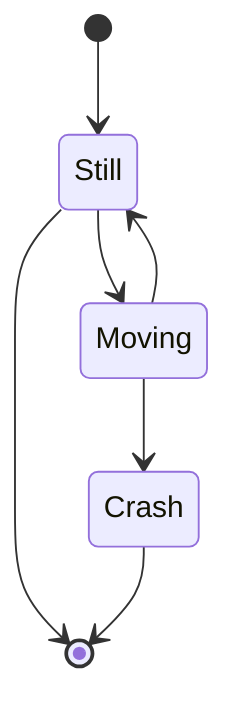

# Using memory in the JVM as it was C

---

* Qué es
    * Diferencia entre heap y offheap
    * Diferencia entre anonima y mapped
* cuándo merece la pena usarla
    * Trabajando directamente con IO
    * Memory Mapped Files
* cómo usar esta memoria en la JVM
    * ByteBuffer
    * Librerias de terceros
    * Unsafe
    * Foreign Memory API
* cuándo no merece la pena usarla
    * Casi siempre
* cómo afecta a nuestro código 
    * Autoclose lo peor
* cómo afecta a nuestros despliegues
    * Problema con K8s
* ejemplos en aplicaciones y librerías reales.
    * Parche en Pinot
    * Mirar Kafka
    * RoaringBitmaps

---

# A bit of theory

---
<!-- header: 'A bit of theory' -->

# A bit of theory
asd