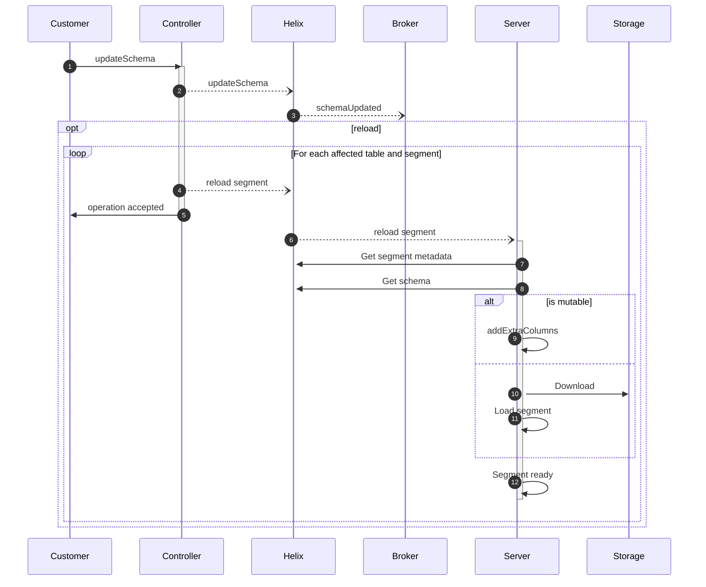

```mermaid
sequenceDiagram
   autonumber
   Customer->>Controller: updateSchema
   activate Controller
   Controller--)Helix: updateSchema
   Helix--)Broker: schemaUpdated

   opt reload
     loop For each affected table and segment
       activate Helix
       Controller--)Helix: reload segment
       activate Server 
       Controller->>Customer: operation accepted
       deactivate Controller
       

       Helix--)Server: reload segment
       activate Server

       Server->>Helix: Get segment metadata
       Server->>Helix: Get schema
       
       alt is mutable
          Server->>Server: addExtraColumns
       else  
         Server->>Storage: Download
         Server->>Server: Load segment
       end
       Server->>Server: Segment ready
       deactivate Server
     end
   end
```