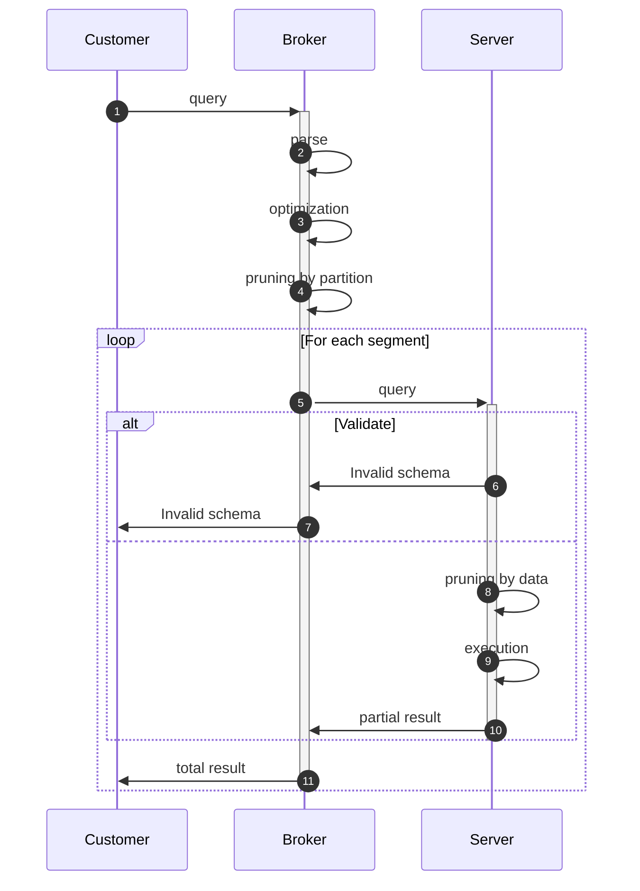

```mermaid
sequenceDiagram
   autonumber
   Customer ->>+ Broker: query
   
   Broker ->> Broker: parse
   
   Broker ->> Broker: optimization
   
   Broker ->> Broker: pruning by partition
   
   loop For each segment
     Broker ->>+ Server: query
     alt Validate
        Server ->> Broker: Invalid schema
        Broker ->> Customer: Invalid schema
     else 
        Server ->> Server: pruning by data
        Server ->> Server: execution
        Server ->> Broker: partial result
     end
     deactivate Server

     Broker ->>- Customer: total result
   end
```