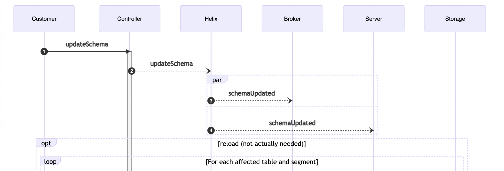

# Pinot: Change add column semantic

[doc](https://docs.google.com/document/d/1UQfTtZ4WYfD2B7qHxP4CW3HxSteJqyrPTdU3aQPyoLo/edit?usp=sharing)

---

* Pinot supports schema evolution by adding new columns
* When a new column is added, Servers prune old segments in an inconsistent way

---

# Example

---

Segment 1
| col1 | col2 |   |
|---|---|---|
| v111  | v121  |   |
| v112  | v122  |   |

Segment 2
| col1 | col2 | col3 |
|---|---|---|
| v211  | v221  | true |
| v212  | v222  | false |

---

| query | result | |
|:---|---|---|
| select col1 from t1  | (v111), (v112), (v211), (v212)  |  |
| select count(id) from t1 | 4  |  |

<!-- This seems ok. -->

---

| query | result | |
|:---|---|---|
| select col3 from t1  | (true), (false)  |  |
| select count(col3) from t1 | 4 | |

---

| query | result | |
|:---|---|---|
| select * from t1 | 2 rows (data in segment2) | |
| select count(*) from t1 | 4 | |

<!-- WHAT? -->

---

| query | result | |
|:---|---|---|
| select count(*) from t1 | 4 | |
| select count(*) from t1 where col3 is not null  | 2  |  |
| select count(*) from t1 where col3 is null | 0  |  |
| select count(*) from t1 where col3 is not null col3 is null | 2 | |

---

<!-- _backgroupdcolor: orange-->

# Definitions

* Effective Schema: The one that is used when queries are executed
* Physical Schema: The one that was used when a segment was created 

---

# Current implementation

* Validate in controller
* Store in ZK
* Communicate though Helix
* React in Brokers
* Optionally update Segments in Servers

---

---

---

# Proposed new implementation

---
## Proposed new implementation

* Servers will store the effective schema for each table
* Servers will validate queries with that schema
  * If a query uses a column that is not in the schema, an error is thrown

---

## Proposed new implementation

* When segments are loaded, Servers checks whether all columns in the effective schema are in the physycal schema or not.
  * If they are there, the type is checked
  * If not, a virtual column is created
    * For each cell, this column returns the default null value on the effective schema

---

---

# How to do it

* Servers should listen for updateSchema Helix messages

---
